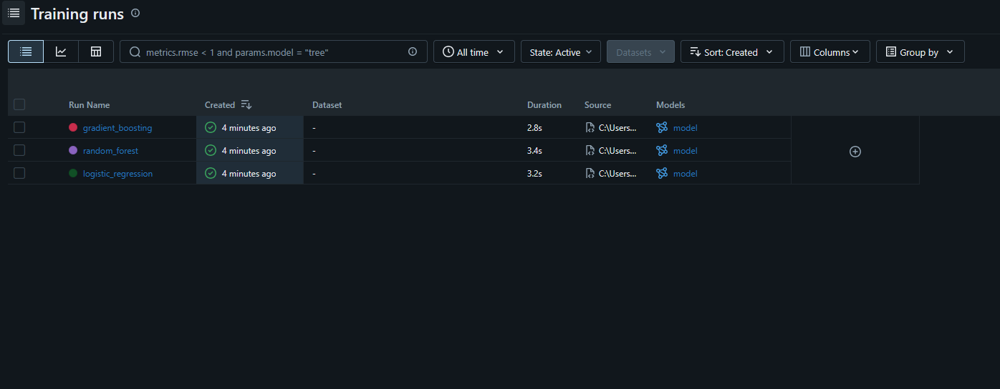
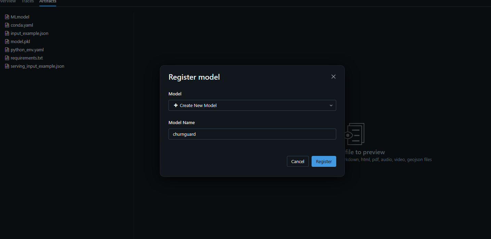
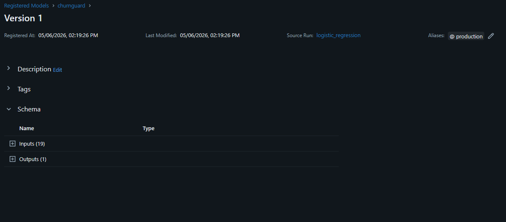
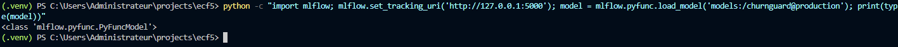
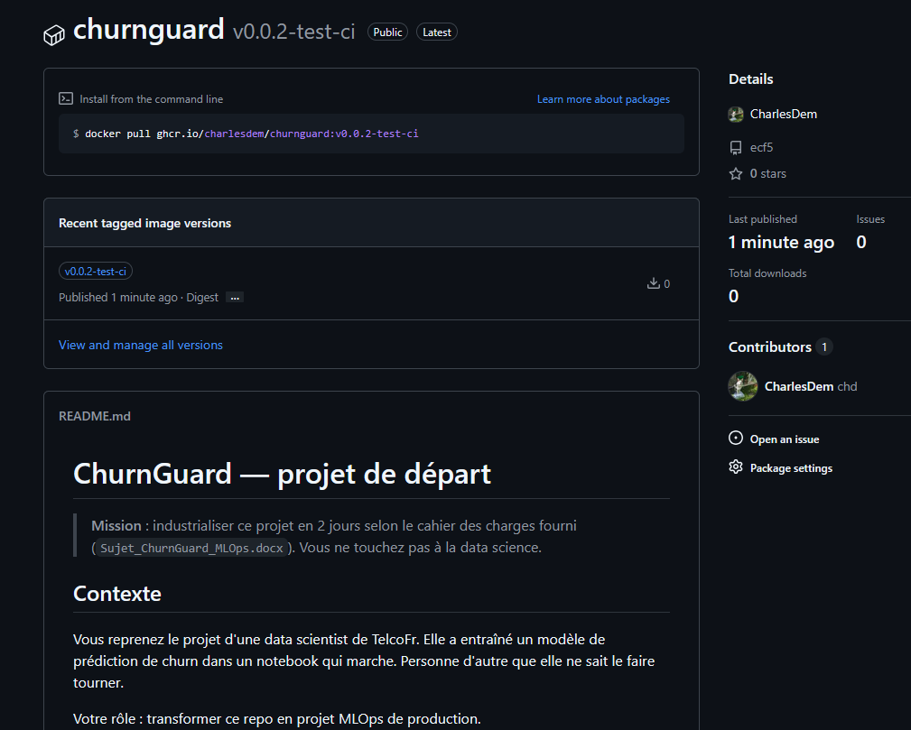

# ChurnGuard

[](https://github.com/CharlesDem/ecf5/actions/workflows/ci-verif.yml)

ChurnGuard est un projet MLOps de prédiction du churn client.

Le projet entraîne plusieurs modèles de machine learning sur des données Telco, suit leurs métriques avec MLflow, sélectionne le meilleur modèle selon le `roc_auc`, puis expose une API FastAPI permettant de prédire si un client présente un risque de churn.

## Objectif du projet

ChurnGuard met en place une chaîne MLOps complète mais volontairement simple :

- chargement des données Telco churn
- nettoyage et préparation des données
- entrainement de plusieurs modèles sklearn 
- suivi des paramètres, métriques et artefacts avec MLflow
- enregistrement des modèles dans MLflow Model Registry
- sélection du meilleur modèle selon le `roc_auc`
- promotion du meilleur modèle avec l'alias `production`
- exposition du modèle via une api FastAPI
- intégration continue avec GitHub actions
- push de l'image Docker API sur GitHub Container Registry lors d'un tag

---

## Architecture

Le projet est composé de plusieurs services Docker.

| Service | Rôle |
|---|---|
| `mlflow` | Serveur mlflow pour le tracking, les artefacts et le model registry |
| `register-model` | Entraine les modèles et log les résultats dans MLflow |
| `api` | Expose une api FastAPI pour effectuer les prédictions |

Le process :

```text
Données Telco Churn
  ↓
Préprocessing
  ↓
Entraînement de plusieurs modèles
  ↓
Logging MLflow
  ↓
Comparaison par roc_auc
  ↓
Promotion du meilleur modèle
  ↓
API FastAPI
  ↓
Prédiction churn
```

---

## Prérequis

Les outils nécessaires sont :

- Git
- Docker
- Python 3.11 pour le développement local hors Docker

---

## Lancer le projet avec Docker Compose

Depuis la racine du projet :

```bash
docker compose up -d
```

Les services sont alors lancés automatiquement.

URLs principales :

| Service | URL |
|---|---|
| MLflow | http://localhost:5000 |
| API FastAPI | http://localhost:8000 |
| Documentation Swagger | http://localhost:8000/docs |

Arrèt les services :

```bash
docker compose down
```

---

## MLflow

MLflow est disponible à l'adresse :

```text
http://localhost:5000
```

MLflow permet de consulter :

- les expériences
- les runs
- les paramètres d'entraînement
- les métriques
- les artefacts
- les modèles enregistrés
- l'alias `production`

Le modèle utilisé par l'API est celui associé à l'alias :

`production`

### Vue des runs MLflow

Rubs :



### Vue du Model Registry

Register :



### Vue du tag production

Production (en haut à droite):



### Vue du tag production

Production (en haut à droite):


---

### Modèle récupérable via python 

En cli :



## API FastAPI

api est disponible à l'adresse :

```text
http://localhost:8000
```

Swagger :

```text
http://localhost:8000/docs
```

predict :

```text
POST /predict
```

L'API retourne une prédiction de churn

Exemple :

```json
{
  "prediction": 1,
  "failure_probability": 0.82,
}
```

Champs retournés :

| Champ | Description |
|---|---|
| `prediction` | Classe prédite : `0` pas de churn, `1` churn |
| `failure_probability` | Probabilité estimée de churn |

---

## Tester l'API avec curl

### Exemple  — Client à risque faible

```bash
curl --location 'http://127.0.0.1:8000/predict' \
--header 'Content-Type: application/json' \
--data '{
    "gender": "Male",
    "SeniorCitizen": 0,
    "Partner": "No",
    "Dependents": "No",
    "tenure": 120,
    "PhoneService": "Yes",
    "MultipleLines": "No",
    "InternetService": "Fiber optic",
    "OnlineSecurity": "No",
    "OnlineBackup": "No",
    "DeviceProtection": "No",
    "TechSupport": "No",
    "StreamingTV": "Yes",
    "StreamingMovies": "Yes",
    "Contract": "Month-to-month",
    "PaperlessBilling": "Yes",
    "PaymentMethod": "Electronic check",
    "MonthlyCharges": 95.0,
    "TotalCharges": 95.0
  }'
```

Réponse possible :

```json
{
  "prediction": 0,
  "failure_probability": 0.00082,
}
```

---

## CI

Le workflow CI est défini ici :

```text
.github/workflows/ci.yml
```

Il est déclenché sur :

- `push`
- `pull_request`

Il exécute :

- lint avec Ruff
- vérification du format avec Ruff
- typecheck avec mypy
- tests avec pytest 
- coverage minimal de 70 %
- build Docker de l'image API
- scan de sécurité avec Trivy


---

## Tag release et push ghrc

Le workflow de release est défini ici :

```text
.github/workflows/release.yml
```

Il est déclenché lorsqu'un tag au format suivant est push :

```text
v*.*.*
```

Exemple :

```bash
git tag v0.1.0
git push origin v0.1.0
```



---

Le workflow :

- build l'image Docker de l'api
- se connecte à GitHub Container Registry avec `GITHUB_TOKEN`
- pousse l'image sur GHCR
- crée une release GitHub avec des notes générées automatiquement.

Image publiée :

```text
ghcr.io/charlesdem/churnguard:v0.1.0
```

---

## Variables d'environnement utiles pour un  .env (mais pas obligatoire)

| Variable | Description | Valeur par défaut |
|---|---|---|
| `MLFLOW_TRACKING_URI` | URL du serveur MLflow | `http://mlflow:5000` |
| `MLFLOW_EXPERIMENT_NAME` | Nom de l'expérience MLflow | `churnguard` |
| `MODEL_NAME` | Nom du modèle enregistré | `churnguard-model` |
| `MODEL_ALIAS` | Alias du modèle utilisé par l'API | `production` |

---

## Structure du projet

```text
.
├── api/
│   ├── __init__.py
│   ├── main.py
│   ├── controller.py
│   ├── service.py
│   ├── models.py
│   ├── exceptions.py
│   └── error_handler.py
│
├── churnguard/
│   ├── __init__.py
│   ├── data.py
│   ├── train.py
│   └── evaluate.py
│
├── scripts/
│   ├── register_model.py
│   └── promote_best_model.py
│
├── tests/
│   ├── test_data.py
│   ├── test_train.py
│   └── data/
│       └── telco_churn_test.csv
│
├── data/
│   └── telco_churn.csv
│
├── .github/
│   └── workflows/
│       ├── ci.yml
│       └── release.yml
│
├── Dockerfile.api
├── Dockerfile.register_model
├── docker-compose.yml
├── requirements-api.txt
├── requirements-train.txt
├── mypy.ini
├── .trivyignore
├── .gitignore
└── README.md
```